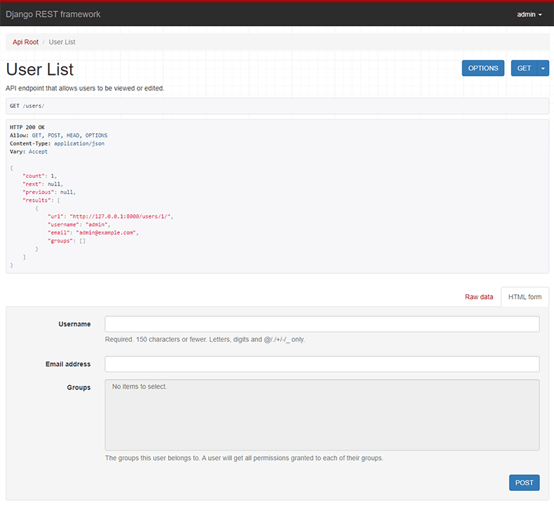

# Manage URLs

Finally, let's create urls to access our ViewSet.

## Register your URLs

First, let's create the `urls.py` file and add a router:

```python title="backend/apps/event/urls.py"
from rest_framework import routers
from .api_views import EventViewSet

router = routers.DefaultRouter()
router.register('event', EventViewSet, basename='event')

urlpatterns = router.urls
```

Then, register your URLs in the `urls.py` file of the project:

```python title="backend/config/urls.py"
from django.urls import include, path

urlpatterns = [
    # ...
    path("api/event/", include("apps.event.urls", namespace="event_api")),
]
```

## Test your URLs

The `DefaultRouter` automatically creates these URLs (we have 2 times `event`,
because it's the name of the app and the name of the model):

| HTTP Method and URL             | View (or action) | Description                                        | (1) | (2) | (3) |
| ------------------------------- | ---------------- | -------------------------------------------------- | --- | --- | --- |
| GET `/api/event/event/`         | list             | Get the list of all events defined by the queryset | ✅  | ❌  | ❌  |
| POST `/api/event/event/`        | create           | Create a new Event object                          | ✅  | ❌  | ✅  |
| GET `/api/event/event/<id>/`    | retrieve         | Get the data of one event by its id                | ✅  | ✅  | ❌  |
| PUT `/api/event/event/<id>/`    | update           | Modify the data of an event                        | ✅  | ✅  | ✅  |
| DELETE `/api/event/event/<id>/` | destroy          | Remove the event from the database                 | ✅  | ✅  | ❌  |

:::note

- (1) Views that call the `has_permission` method of the Permission class (all)
- (2) Views that call the `has_object_permission` method of the Permission class (`details=True`).
- (3) Views that call the `validate` method of the Serializer class.

:::

You can now use these URLs in the front end, or directly in the browser to test
your API!


