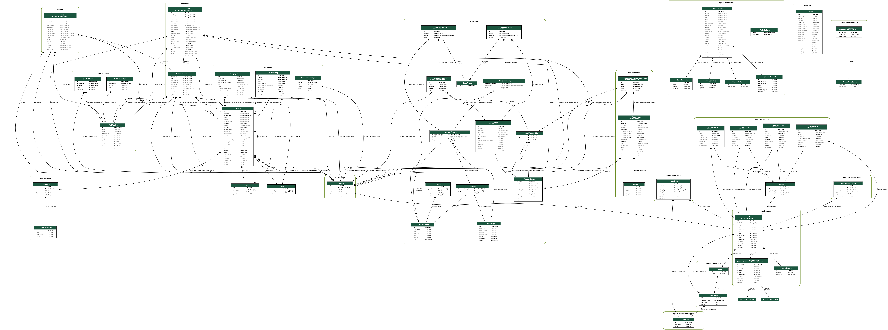

import DatabaseSchema from './database.excalidraw.svg'

# Database

The following schema is an entity-relationship diagram of the database,
simplified for your convenience 😉

<DatabaseSchema />

In Django, entities are represented by a **model** class, and relationships are
directly represented by _OneToOneField_, _ForeignKey_ or _ManyToManyField_ fields.
Their translation to SQL is done by the Django ORM.

Want more? Here is the full schema, auto-generated

This schema has been generated by `django-extensions` with the `graphviz` program.
It shows all tables from the database, including the hidden ones created by
Django itself.

How to generate this schema

This model has been automatically generated with the method described on
[this post](https://medium.com/@yathomasi1/1-using-django-extensions-to-visualize-the-database-diagram-in-django-application-c5fa7e710e16).

If you have problems in running the method described above, you have to run before the other commands this command:
`sudo apt-get install libgraphviz-dev libpython3.7-dev`

