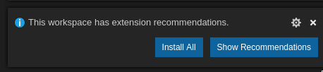
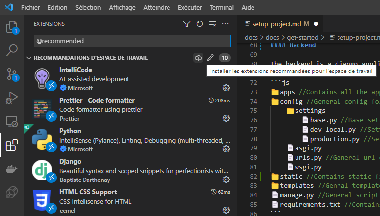

import Tabs from '@theme/Tabs';
import TabItem from '@theme/TabItem';

# Configure your tools

Now that's every softwares are installed, let's set up them!

## Clone the repository

<Tabs>
<TabItem value="git-desk" label="Using Github Desktop">

1. Start **Github Desktop**
2. Select _"Clone a repository from the internet"_ (if you don't see the button, select `File > Clone repository`)
3. Paste the repository url: `https://github.com/3cn-ecn/nantralPlatform.git`, or only
   `3cn-ecn/nantralPlatform`, and clone the repository!
4. Wait during the download, and then click the _"Open in Visual Studio Code"_ button (if you see another text editor,
   open the Github Desktop preferences and set the text editor to VS Code)

</TabItem>
<TabItem value="git-code" label="Using VS Code">

1. Start by opening VSCode.
2. Once your folder is opened, press <kbd>CTRL</kbd> + <kbd>SHIFT</kbd> + <kbd>P</kbd> (for Mac users: <kbd>CMD</kbd> + <kbd>SHIFT</kbd> + <kbd>P</kbd>), then type `Clone` and press <kbd>ENTER</kbd>.
3. In the prompt window, paste `https://github.com/3cn-ecn/nantralPlatform.git`.
4. When prompted, select a folder where you want to clone the repository. This will create a folder named `nantralPlatform` where everything will be stored.
5. Open the `nantralPlatform` folder in VSCode once the repository has ben cloned.

:::info
A detailed tutorial with screenshots is available [here](https://code.visualstudio.com/docs/editor/versioncontrol#_cloning-a-repository).
:::

</TabItem>
</Tabs>

## Set up VS Code

### Install the extensions

The first time you open the `nantralPlatform` folder in VSCode,
you should see this pop-up:



Click the _"Install all"_ button, and you're ready!

<details>
    <summary>Oops, I decline the pop-up...</summary>

Don't worry, you can find all the recommended extensions in the extensions menu.
Press <kbd>CTRL</kbd>+<kbd>SHIFT</kbd>+<kbd>P</kbd>, and search **Extensions: Show Recommended Extensions**.
The list of all recommended extensions will appear on the left panel, and you can then click the download
button to install them:



</details>

## Discover the project structure

In VSCode, in the left panel, you can see the folder structure of the repository.
Here are a few explanations about the purpose of the main folders.

```js title=".../nantralplatform/"
📁 .github    // Github Actions (CI and CD)
📁 .vscode    // Config of VS code
// highlight-start
📁 backend    // Django project
    📁 apps       // each 'app' is a part of the website
    📁 config
    📁 static
    📁 templates
    📄 manage.py
    📄 Pipfile    // Dependencies file
// highlight-end
📁 deployment // Docker files and back-up scripts
📁 docs       // Documentation website (Docusaurus)
    📁 docs
    📄 package.json
📁 email-templates-generator  // Generate HTML templates for emails in Django
    📁 emails
    📄 package.json
// highlight-start
📁 frontend   // React project
    📁 src
        📁 modules    // equivalent to apps in Django
        📁 pages      // the pages the user see
        📁 shared
        📄 App.tsx
    📄 package.json    // Dependencies file
// highlight-end
📄 Makefile   // make update command
📄 README.md
```

### The Backend

The backend is a django application. The most important files and directories are:

- **apps**: in this folder are stored the _apps_, i.e. a part of the website
  (for example we have an app for the clubs, another one for the rommates map, etc.)
- **config**: in this folder are stored the root urls and the configuration of django.
- **static**: in this folder are stored the _static_ files of django, that is to say
  the files that are not part of the source code and should be not compiled
  by the server (for examples images, fonts, etc.)
- **templates**: this folder is about the main template of django, that is to summary
  the HTML page which is used as a base for every page
- **manage.py**: this file contains the main commands of django. For example,
  you can use `python3 manage.py runserver` to run the server.
- **Pipfile**: this file contains the dependencies of the project,
  and some shortcuts for everyday commands (for example we have the shortcut
  `pipenv run start` for `python3 manage.py runserver`). All shortcuts begin
  with `pipenv run`.

### The Frontend

The frontend is an **node.js** application which uses **React.js**.

It is supposed to contain all the user interface, but for the moment we only
have some pieces of interface defined in the frontend (like the notification
panel or the roommates map for example). All the rest of the interface is
defined in django, but in the future everything will be defined in the frontend.

The main structure is like this:

- **src**: contains all the source files of the react application
- **package.json**: contains the dependencies of the project, and also some shortcuts
  (for example `npm run start` to compile the source code in live). All
  shortcuts begin with `npm run`.

### The documentation website

The documentation website is a **docusaurus** application, also built with
_node.js_.

- **docs**: this sub-directory contains all the pages of the doc website,
  in the markdown format. You can also use React component inside the pages!
- **static**: this folder contains all the static files of the documentation
  website, like images for example.
- **package.json**: contains the dependencies of the project, and some shortcuts
  like `npm run start` to compile and open the doc website on your computer.
