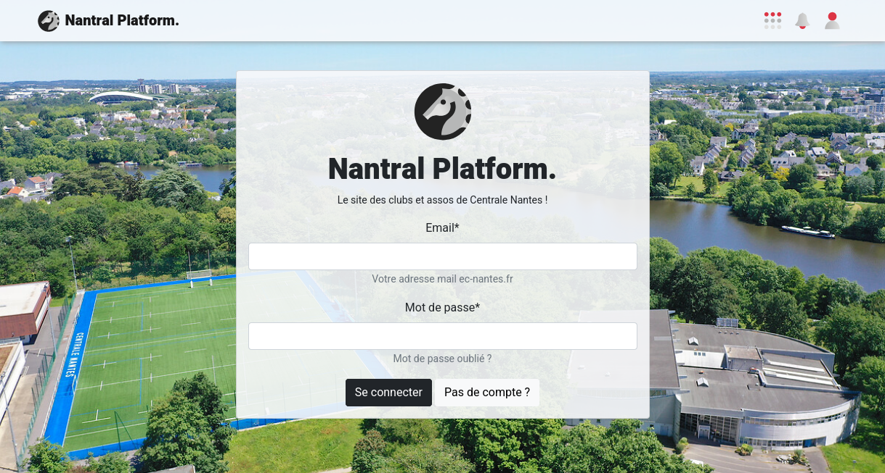

import Tabs from '@theme/Tabs';
import TabItem from '@theme/TabItem';

# First Launch

It's time to run _Nantral Platform_ on your computer!

## Set up the project

Open a terminal in the `nantralPlatform` directory (for convenience, you can
open this terminal inside of VS Code but it also works if you use your regular
terminal), and run:

```bash
make install
```

It creates a new virtual environment and installs all the dependencies for the
_back end_ and the _front end_, and creates a new database for you with a
default `admin` user.

<details>
    <summary>Help! The <code>make</code> command does not work with me! 😥</summary>

Well, sorry you're not lucky! But don't worry, here are all the steps you can do
to install everything.

1. Go into the `backend` directory:

   ```bash
   cd backend/
   ```

2. In the `backend/config/settings` directory, create a copy of the file
   `.env.example` and rename it `.env` only.

3. Install dependencies and create a virtuel environment for python:

   ```bash
   pipenv install --dev
   ```

   If you get an error with the Python version, install [pyenv](https://github.com/pyenv/pyenv).

4. Create your database for django:

   ```bash
   pipenv run django migrate
   ```

5. Create an administrator account on this database:

   ```bash
   pipenv run django createsuperuser
   ```

   When asked, complete as follow:

   - username: `admin`
   - email: `admin@ec-nantes.fr`
   - password: `admin`

   _Note: if `admin` already exists, run `pipenv run django changepassword admin`
   to change the password of the admin account to `admin`._

6. Now, change your working directory to the `frontend` one:

   ```bash
   cd ../frontend
   ```

7. Install the dependencies:

   ```bash
   npm install
   ```

8. Then, change your working directory to `email-templates-generator`:

   ```bash
   cd ../email-templates-generator
   ```

9. Install the dependencies:

   ```bash
   npm install
   ```

10. And build the email templates:

    ```bash
    npm run build
    ```

Congratulations, you did it all 🥳

</details>

## Start the server

Now it's time to launch the website! To do this:

1. Go into the frontend directory and launch the frontend server (react):
   ```bash
   cd frontend/
   npm run start
   ```
1. In another terminal, go into the backend directory and launch the backend server (django):
   ```bash
   cd backend/
   pipenv run start
   ```
1. Open this address in your browser: [http://localhost:8000](http://localhost:8000)

And that's it! You should now see the login page of Nantral Platform:



## Create your admin account

Since we have created your own database, you do **not** have an account yet
on this particular database. So let's create one!

1. On the login page, **click the _"No Account?"_** button, and fill in your
   info to create your personal account.

   :::tip Note

   - Your password will be only stored on your computer: this is not really secure,
     so do not use a password similar to your real online accounts!
     You can instead use a dummy password like `password` for example.
   - The email will not really be checked, so you can use a dummy one too
     (it must only finish with `ec-nantes.fr`). This allows you to create
     multiple accounts, to test your code later 😉
   - At the end of the process, the website will ask you to validate your account:
     just ignore it for the moment.

   :::

1. Now, open the admin panel ([http://localhost:8000/admin](http://localhost:8000/admin)),
   and **log in** with the fake **admin account** created by default
   (_username: `admin`, password: `admin`_)

   - Note: if the password does not work, you can reset the password:
     ```bash
     cd backend
     pipenv run django changepassword admin
     ```

1. Once connected, open **_"Account > Users"_**
   (or _"Account > Utilisateurs"_ in French)

1. **Search** for your personal account (the one you created a few minutes ago)
   and **open** it.

1. Scroll down to the **_Permissions_** section, and check the 3 checkboxes:

   - `Active` (_Actif_): this will validate your account
   - `Staff status` (_Statut équipe_): this allows you to connect to the admin panel
     with your personal account
   - `Superuser status` (_Statut super-utilisateur_): this transforms your personal
     account into an admin account!

1. **Save** your modifications with the button at the bottom.

1. **Log out** from the admin interface.

1. Finally, go back to _Nantral Platform_
   ([http://localhost:8000](http://localhost:8000)), and **log in** with
   your personal account!

1. Congratulations, you now have a personal admin account on your database 🥳

---

_To go further..._
:::info Why can I not directly use the _admin_ account?

In facts, on Nantral Platform, we have 2 tables in our database for representing
a user: the first one is called `User`, and the second one `Student`. The
`User` table is made for the authentification and permissions processes, and the
`Student` one is made for the profile of the user.

The _admin_ account is only created during the installation process as an
element of the `User` table, and has no equivalent in the `Student` table:
hence, the _admin_ account will not really work on Nantral Platform. That's why
you need to create your account with the login page, to have both enabled.
:::
