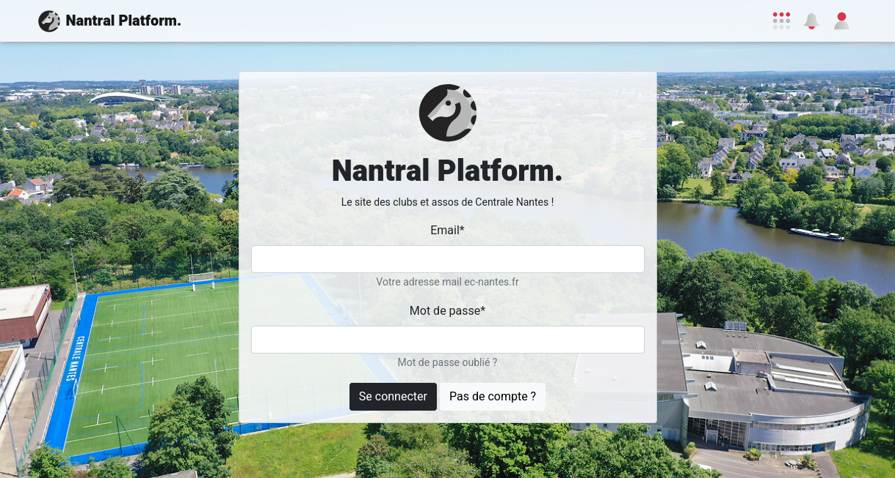

import TabItem from '@theme/TabItem';
import Tabs from '@theme/Tabs';

# First Launch

It's time to run _Nantral Platform_ on your computer!

## Set up the project

Open a terminal in the `nantralPlatform` directory (for convenience, you can
open this terminal inside of VS Code but it also works if you use your regular
terminal), and run:

```bash
make install
```

It creates a new virtual environment and installs all the dependencies for the
_back end_ and the _front end_, and creates a new database for you with a
default `admin` user.

<details>
    <summary>Help! The <code>make</code> command does not work with me! 😥</summary>

Well, sorry you're not lucky! But don't worry, here are all the steps you can do
to install everything.

1. Go into the `backend` directory:

   ```bash
   cd backend/
   ```

2. In the `backend/config/settings` directory, create a copy of the file
   `.env.example` and rename it `.env` only.

3. Install dependencies and create a virtuel environment for python:

   ```bash
   pipenv install --dev
   ```

   If you get an error with the Python version, install [pyenv](https://github.com/pyenv/pyenv).

4. Create your database for django:

   ```bash
   pipenv run django migrate
   ```

5. Create an administrator account on this database:

   ```bash
   pipenv run django createsuperuser
   ```

   When asked, complete as follow:

   -  username: `admin`
   -  email: `admin@ec-nantes.fr`
   -  password: `admin`

   _Note: if `admin` already exists, run `pipenv run django changepassword admin`
   to change the password of the admin account to `admin`._

6. Now, change your working directory to the `frontend` one:

   ```bash
   cd ../frontend
   ```

7. Install the dependencies:

   ```bash
   npm install
   ```

8. Then, change your working directory to `email-templates-generator`:

   ```bash
   cd ../email-templates-generator
   ```

9. Install the dependencies:

   ```bash
   npm install
   ```

10.   And build the email templates:

      ```bash
      npm run build
      ```

Congratulations, you did it all 🥳

</details>

When the installation is finished, refresh your IDE: for VScode, tap

<kbd>Ctrl</kbd>+<kbd>Shift</kbd>+<kbd>P</kbd>, search for **"Reload Windows"**,
and tap <kbd>Enter</kbd>.

## Start the server

Now it's time to launch the website! To do this:

1. Go into the frontend directory and launch the frontend server (react):
   ```bash
   cd frontend/
   npm run start
   ```
1. In another terminal, go into the backend directory and launch the backend server (django):
   ```bash
   cd backend/
   pipenv run start
   ```

<Tabs>
<TabItem value="local" label="Local">

3. Open this address in your browser: [http://localhost:8000](http://localhost:8000)

</TabItem>
<TabItem value="codespaces" label="Github Codespaces">

3. The ports 8000 and 5173 are automatically **forwarded** by VScode. The port
   8000 is automatically opened in **a new tab**.
4. Go back into the vscode tab of your browser. You need to change
   the **visibility** of the ports to **public**:

   -  open the **_Ports_** tab on the bottom bar of VS code
   -  right click on each port, and select _Port visibility_ > _Public_

   You can also run this command to change the visibility of both ports:

   ```
   gh codespace ports visibility 5173:public 8000:public --codespace $CODESPACE_NAME
   ```

5. Go back to the tab **previously** opened automatically.

</TabItem>
</Tabs>

And that's it! You should now see the login page of Nantral Platform:



## Create your admin account

Since we have created your own database, you do **not** have an account yet
on this particular database. So let's create one!

1. On the login page, **click the _"No Account?"_** button, and fill in your
   info to create your personal account.

   :::tip Note

   -  Your password will be only stored on your computer: this is not really secure,
      so do not use a password similar to your real online accounts!
      You can instead use a dummy password like `password` for example.
   -  The email will not really be checked, so you can use a dummy one too
      (it must only finish with `ec-nantes.fr`). This allows you to create
      multiple accounts, to test your code later 😉
   -  At the end of the process, the website will ask you to validate your account:
      just ignore it for the moment.

   :::

1. Now, open the admin panel ([http://localhost:8000/admin](http://localhost:8000/admin)),
   and **log in** with the fake **admin account** created by default
   (_username: `admin@ec-nantes.fr`, password: `admin`_)

   -  Note: if the password does not work, you can reset the password:
      ```bash
      cd backend
      pipenv run django changepassword admin
      ```

1. Once connected, open **_"Account > Users"_**
   (or _"Account > Utilisateurs"_ in French)

1. **Search** for your personal account (the one you created a few minutes ago)
   and **open** it.

1. Scroll down to the **_Permissions_** section, and check the 3 checkboxes:

   -  `Active` (_Actif_): this will validate your account
   -  `Staff status` (_Statut équipe_): this allows you to connect to the admin panel
      with your personal account
   -  `Superuser status` (_Statut super-utilisateur_): this transforms your personal
      account into an admin account!

1. **Save** your modifications with the button at the bottom.

1. **Log out** from the admin interface.

1. Finally, go back to _Nantral Platform_
   ([http://localhost:8000](http://localhost:8000)), and **log in** with
   your personal account!

1. Congratulations, you now have a personal admin account on your database 🥳
