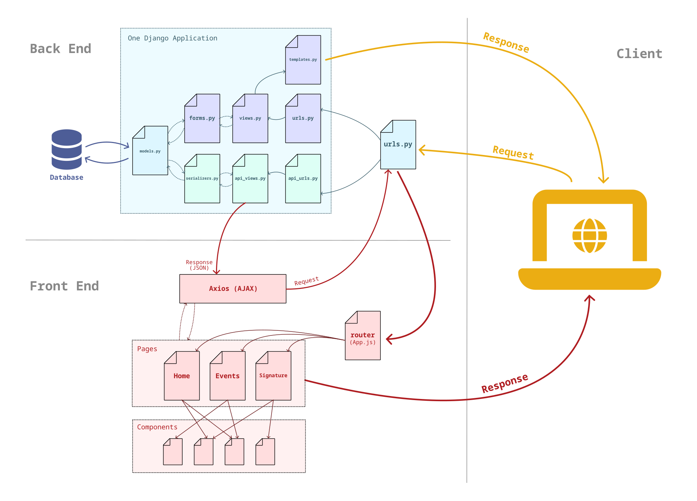

# Architecture

Discover the main architecture of the Nantral Platform project.

## Definitions

First, you need to understand the difference between frontend and backend:
* **the frontend**: it is the code which is compiled and run on the **client**, that is to say in the own browser
    of the user. Its purpose is to simulate the behavior of a regular application.
* **the backend**: it is the code which will run on the **server**. Its purpose is to make the link between the frontend
    and the database: when a user register himself in a group for example, the frontend will send a request to the
    backend, and then the backend will verify the rights of the user and update the database in consequence.

## Languages and frameworks

For the nantral platform project, we use two main languages and frameworks for the backend and the frontend:
* **on the backend**: we use [Python](https://www.python.org/), with the framework [django](https://www.djangoproject.com/)
* **on the frontend**: we use [TypeScript](https://www.typescriptlang.org/), with the framework [React](https://reactjs.org/)

:::info What is a framework?
A framework is a module, or a library, with a set of predefined useful functions to achieve a certain goal.
For instance, django gives functions to connect to the database or to manage the http protocol, so as we don't have
to implement these functions ourselves.
:::
