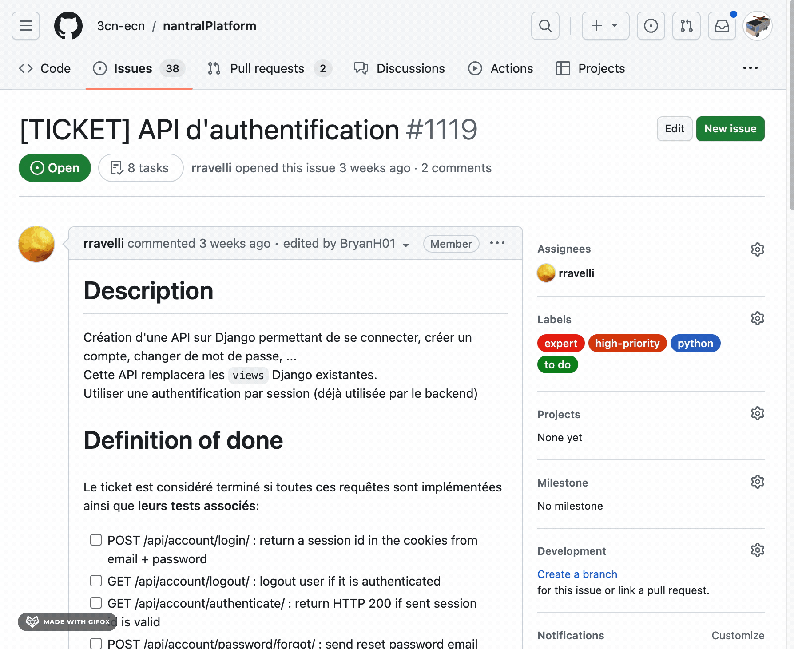

# How to make a PR

Here is a typical workflow for contributing on the project with Git.

## 1. Create a ticket

Before beginning to code, you must decide **_what_** you will code: for this,
create a new ticket on the [GitHub repository](https://github.com/3cn-ecn/nantralPlatform/issues).

Your ticket should describe:

- what you will change,
- which criteria someone can check to validate your ticket when you will have finished to code,
- a design or mock-up of the interfaces you will create (you can use for example [Excalidraw](https://excalidraw.com/)),
- the changes you will make on the database,
- the different steps you will follow to code.

## 2. Create a new branch

Then, you can create a branch a new branch from the issue (**don't clone the repository on your personnal account !** You'll not be able to enjoy all the features of 3CN's GitHub):



and then switch to this new branch in VS code (or use GitHub Desktop):

```bash
git checkout <my-new-branch>
```

## 3. Code

Time to code! This part is up to you now ^^

Do not forget to make multiple commits during your work: a commit should be
a small step during your work, and help you to go back if you make a mistake.
They also can help another developer to review your code later, so be sure to
name them explicitly!

## 4. Create a pull request

When you have finished to code, you can create a pull request on GitHub: simply
go to the _Pull Request_ tab, and create a new one from your branch to the
`master` branch.

Describe your changes in the pull request, and read all your code a second
time: this will help you to catch frequent bugs. Wait for the tests to pass:
if a test fails, check which test has failed and try to understand why.

## 5. Merge your PR!

If everything is ok, ask someone to review your code. It is always better
for the code to be reviewed twice: one time by the author (you!), and the
second time by someone else.

Then, once your PR is approved, you can merge it! Congratulations, you have
contributed to Nantral Platform! 🥳

## 🛟 F.A.Q.

### Should I use _merge_ or _squash_ to validate my Pull Request?

You can use either you want, but consider this:

- `squash` is better because it will keep the history clean, and will avoid
  to have a lot of commits in the history. However, you can't add new commits
  on your branch when the commits are squashed, so you have to immediately
  delete your branch and create a new one if you see some bugs in production.
- `merge` is more sure, but it keeps all the commits in the history and it
  can be a mess later.

### Someone has push new commits on the master branch, how to update my branch?

To update your branch, you need to do a **rebase**.
In your terminal, type the following to rebase your branch on the `master` branch:

```bash
git fetch
git rebase origin/master
```

Then, look into the _Git Panel_ of VS code: if they are conflicts, it will show
them to you. You can then fix them, and then validate them by clicking
_Continue_. Repeat these steps again for each commit where there are conflicts,
until VS code does not show anymore the _Continue_ button.

In the VS code files, **`Current change`** represents the code
from the branch `master`, and **`Incoming change`** represents the code from your
branch.

:::caution Warning
If you have already pushed your branch on GitHub, the `git push` command
will not work after a rebase. You need to make a **forced push** to update your
branch on GitHub: `git push -f`.
:::
