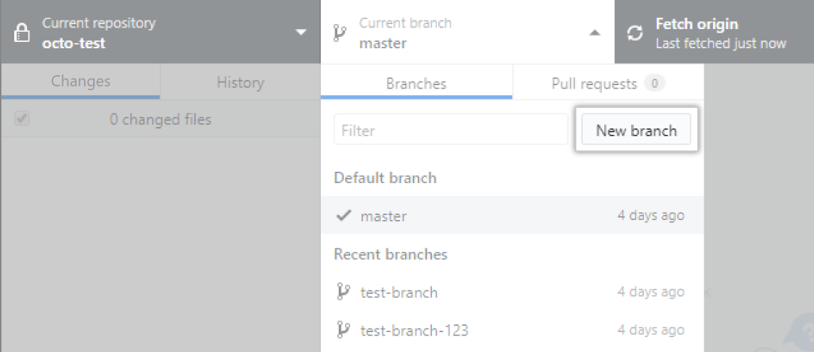
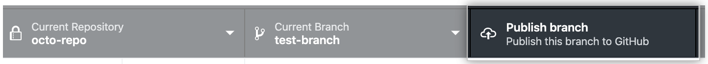
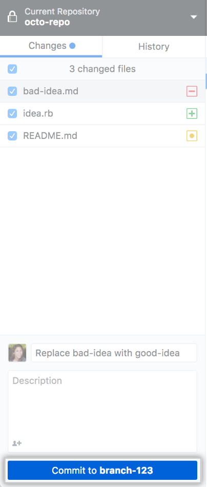
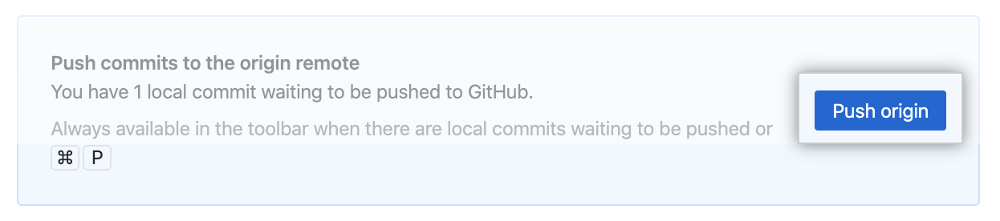
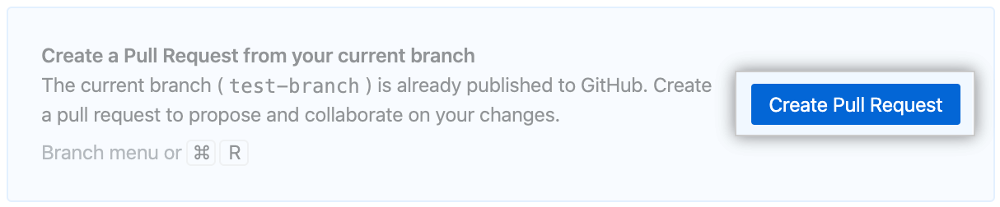

# GitHub Desktop Tutorial

Let's learn git and github by a simple example: you will try to add your
name on the README.md page of the github project.

## Presentation

## Make your first commit

It's time to make your first commit! This page explains how to do it with Github
Desktop, for beginners. If you use another git interface or the git cli, we
suppose that you are able to transpose the actions with your git interface.

### 1. Create a new branch

- In Github Desktop, create a new branch from `master`, and give it a name. **It's useless to clone the repository on your own GitHub account** because you'll not be able to use all the features that are available on 3CN's GitHub.

:::info
We recommand you to create a new branch before writing new changes to the code. Indeed, the default selected branch
is `master`, which is the branch directly linked to the server. This branch is therefore protected, so you cannot
push changes on it.
:::

- Then publish your new branch to Github:

:::info
If you cannot publish the branch, that means that you do not have the right to write on the repository.
You can ask one of the administators of the repository (for example the president of the club) to grant you
this access by adding you to the nantral-platform organization.
:::

### 2. Make your changes

- In VS Code, open the `README.md` file in the main directory.
- Add your name and a link to your github account under the `Contributors` section, at the end of the file
- Save the file

### 3. Publish your changes

- Now go back to Github Desktop, give a name to the commit and create it:

- Then push your commit on the github server:

- Finally create a pull request:

- Now the github website should open in your browser. Click the _"Create pull request"_ button, and then
  _"Merge pull request"_.

- Congratulations, you're done! 🥳 You can now see your name on the home page of the repository:
  [github.com/3cn-ecn/nantralPlatform](https://github.com/3cn-ecn/nantralPlatform)
