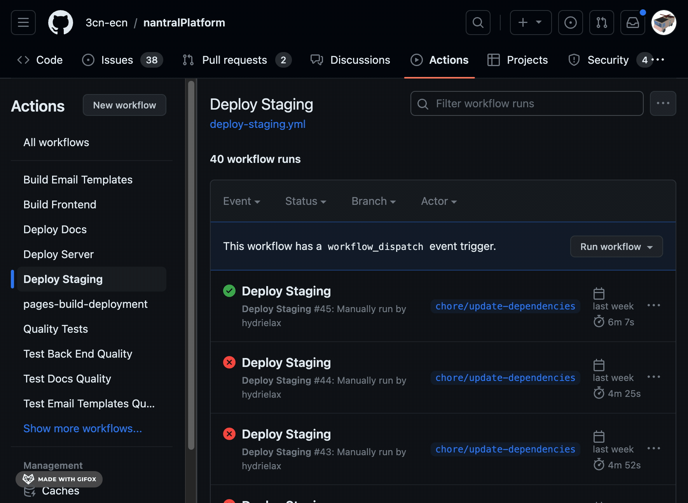

# Staging Server

🌐 Address: [https://dev.nantral-platform.fr](https://dev.nantral-platform.fr)

## 1. Why a staging server?

The purpose of the staging server is to test dangerous modifications before
deploying them on the production server.

### 🤔 When should I use the staging server?

- When you update the database (for example creating new migrations or updating
  the `models.py` files)
- When you add new dependencies to the project (`Pipfile` or `package.json`)
- More generally, when you are not sure about your code and want to test it!

### 🤔 What can I test on the staging server?

You can test:

- all modifications of the backend (Python code)
- all modifications of the frontend (Javascript code)

You **_cannot_** test:

- the documentation website
- the periodic celery tasks (scheduled tasks)
- the docker configuration (`docker-compose.yml` and `Dockerfile`)
- the deployment scripts (database backup, deployment, etc.)
- the github actions

## 2. How to test my code on the staging server

_Prerequisite: your code should be pushed on GitHub on a specific branch.
For our example, let's call this branch `my-feature-branch`._

1. In GitHub, on the Nantral Platform repository, go to the _Actions_ tab and
   then select the _Deploy Staging_ action:
   [https://github.com/3cn-ecn/nantralPlatform/actions/workflows/deploy-staging.yml](https://github.com/3cn-ecn/nantralPlatform/actions/workflows/deploy-staging.yml)
2. Click the _Run workflow_ button and select your branch (`my-feature-branch`)
3. Click the button _Run workflow_ to confirm and start the deployment!

:::info Note
The deployment can take up from 5 to 10 minutes. If you push new changes to the
branch, you need to relaunch the Github Action to deploy the new changes.
:::
