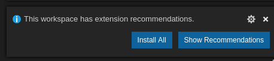
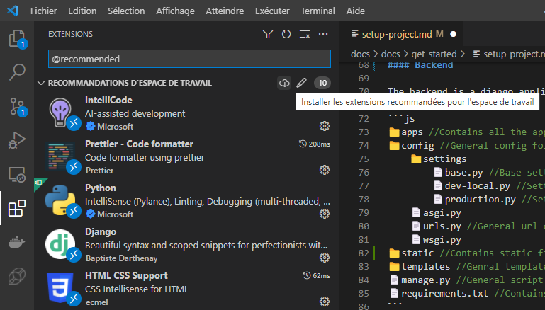

import Tabs from '@theme/Tabs';
import TabItem from '@theme/TabItem';

# Set up the project

Let's set up the project, with git and vs code!

## Clone the repository

<Tabs>
<TabItem value="git-desk" label="Using Github Desktop">

1. Start **Github Desktop** 
2. Select *"Clone a repository from the internet"* (if you don't see the button, select `File > Clone repository`)
3. Paste the repository url: `https://github.com/nantral-platform/nantralPlatform.git`, or only 
    `nantral-platform/nantralPlatform`, and clone the repository!
4. Wait during the download, and then click the *"Open in Visual Studio Code"* button (if you see another text editor, 
    open the Github Desktop preferences and set the text editor to VS Code)

</TabItem>
<TabItem value="git-code" label="Using VS Code">

1. Start by opening VSCode.
2. Once your folder is opened, press <kbd>CTRL</kbd> + <kbd>SHIFT</kbd> + <kbd>P</kbd> (for Mac users: <kbd>CMD</kbd> + <kbd>SHIFT</kbd> + <kbd>P</kbd>), then type `Clone` and press <kbd>ENTER</kbd>.
3. In the prompt window, paste `https://github.com/nantral-platform/nantralPlatform.git`.
4. When prompted, select a folder where you want to clone the repository. This will create a folder named `nantralPlatform` where everything will be stored.
5. Open the `nantralPlatform` folder in VSCode once the repository has ben cloned.

:::info
A detailed tutorial with screenshots is available [here](https://code.visualstudio.com/docs/editor/versioncontrol#_cloning-a-repository).
:::

</TabItem>
</Tabs>


## Set up VS Code

### Discover the project structure

#### Description

In VSCode, in the left panel, you can see the folder structure of the repository. Here are a few explanations about the purpose of the main folders.

```js title=".../nantralplatform/"
📁.github    //Contains the definitions for github actions
📁.vscode    //Contains the configuration of vs code
// highlight-next-line
📁backend    //Contains source files for the backend
📁deployment //Contains the instructions for the deployment
// highlight-next-line
📁docs       //Contains source files of the documentation
// highlight-next-line
📁frontend   //Contains source files to be compiled for the frontend
📁scripts    //Contains some scripts for the deployment
```

#### Frontend

The frontend is an NPM application which uses React.js.
Source files are compiled using Babel and Webpack and the output is stored in `server/static/js`.

#### Backend

The backend is a django application. The main files are organised like this:

```js
📁apps //Contains all the applications
📁config //General config folder
    📁settings
        📄base.py //Base settings
        📄dev-local.py //Settings for local dev
        📄production.py //Settings for production
    📄asgi.py
    📄urls.py //General url config
    📄wsgi.py
📁static //Contains static files to be served by the server
📁templates //Genral template folder
📄manage.py //General script to launch and make migrations
📄requirements.txt //Contains python requirements
```

### Import the configuration files

At this point, the project must be opened in VS Code. In the `.vscode` directory, create a copy of the file named
`settings-sample.json`, and rename it `settings.json`. This will import all the needed settings for VS Code !

And voilà, it's already done! It's easy, no? 😁

### Install the extensions

The first time you open the project in VS Code, you should see this pop-up:



Click the *"Install all"* button, and you're ready!

:::note Oops, I decline the pop-up...
Don't worry, you can find all the recommended extensions in the extensions menu.
Press <kbd>CTRL</kbd>+<kbd>SHIFT</kbd>+<kbd>P</kbd>, and search **Extensions: Show Recommended Extensions**.
The list of all recommended extensions will appear in the left panel, and you can then click the download
button to install them:


:::