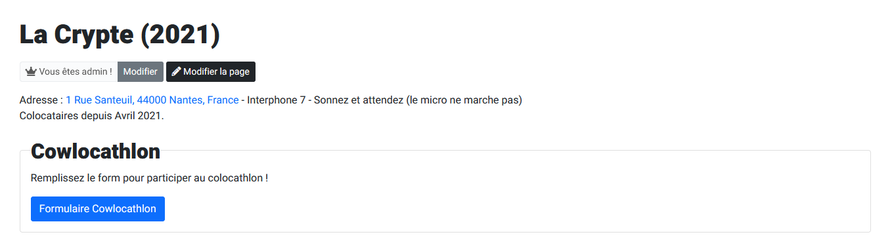
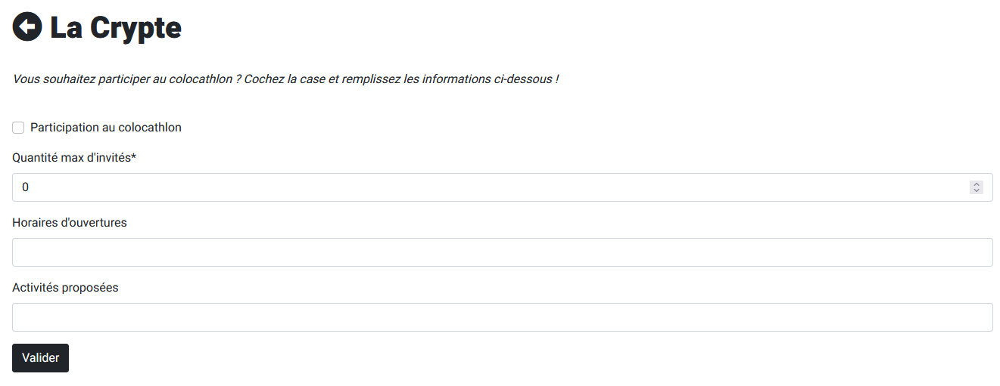
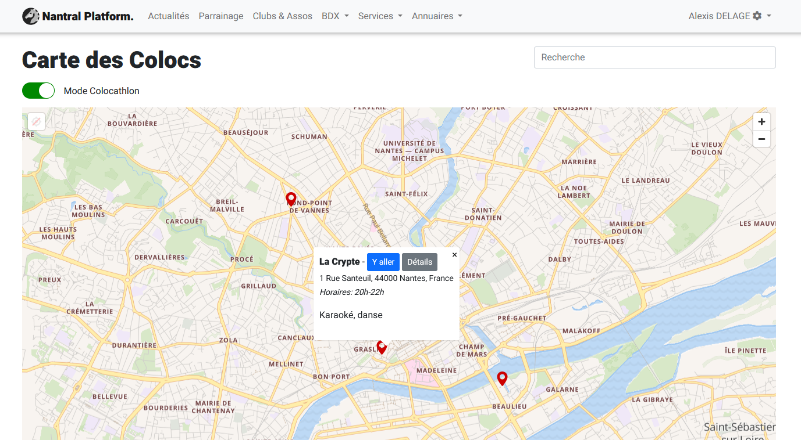
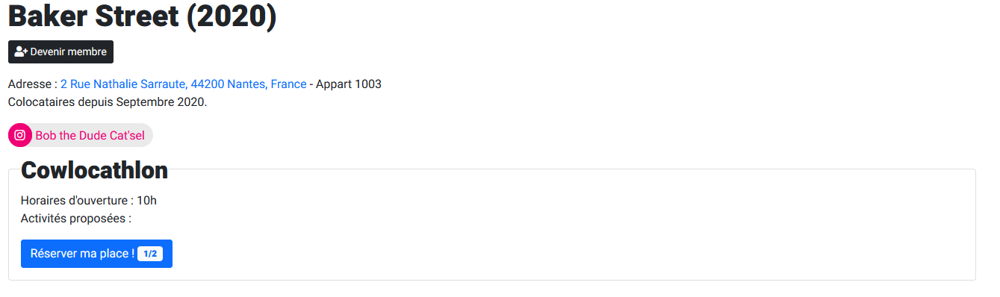

import './styles.scss';

# Colocathlon

Chaque année, le BDE organise le colocathlon. L'idée est de permettre aux EI1 de
visiter les colocations des EI2+ en faisant plusieurs activités diverses et variées.

L'organisation du colocathlon se déroule en 3 phases :

- **Phase 0 :** Pas de colocathlon
- **Phase 1 :** Chaque coloc indique si elle souhaite participer ou non au colocathlon
- **Phase 2 :** Les EI1 s'inscrivent sur une coloc pour le début de la soirée

:::info
Ces 3 phases sont représentées par le paramètre `PHASE_COLOCATHLON`, modifiable
via l'interface admin : https://nantral-platform.fr/admin/extra_settings/setting/
:::

## Phase 1 : Inscription des colocs

_Cette phase ne s'affiche que si le paramètre `PHASE_COLOCATHLON` est défini à `1`._

Pendant la phase 1, les colocs sont invitées à indiquer leur choix de participer
ou non au colocathlon. Pour se faire, un post facebook les invite à se connecter
à Nantral Platform, puis à faire les étapes suivantes :

1. Se connecter à la carte des colocs
2. Aller sur la page de sa propre coloc ou la créer si elle n'existe pas
   :::success Astuce
   Pour aller plus vite, on peut partager le lien
   [https://nantral-platform.fr/my_coloc](https://nantral-platform.fr/my_coloc) qui
   redirige directement vers la page de la coloc de l'utilisateur connecté.
   :::
3. Ce message s'affiche alors :
   
4. En cliquant sur le bouton, on peut alors remplir le formulaire suivant :
   

:::caution Point de vigilance
Pour accéder au formulaire, il suffit d'être membre (et non admin comme c'est
le cas pour les autres formulaires du site), donc n'importe qui peut modifier
les données d'une autre coloc en s'ajoutant puis s'enlevant des membres.
:::

## Phase 2 : Inscription des EI1

_Cette phase ne s'affiche que si le paramètre `PHASE_COLOCATHLON` est défini à `2`._

1. Pour commencer, les EI1 peuvent se connecter à la carte des colocs et activer
   le **"Mode Colocathlon"** pour ne voir que les colocs participantes au
   colocathlon. Les infobulles sur les colocs sont aussi modifiées afin
   d'afficher les heures d'ouvertures et les activités proposées.
   
2. Si une coloc les intéressent, les EI1 peuvent cliquer sur le bouton
   _Détails_ dans l'infobulle pour accéder à la page de la coloc : ils
   peuvent alors voir le nombre de personnes déjà inscrites sur la coloc, le
   nombre maximal autorisé, et choisir si ils souhaitent s'y inscrire ou non.
   
3. Une fois le bouton cliqué, ils ont aussi toujours la possibilité de se
   désinscrire pour libérer leur place.
4. Du côté des colocataires de la coloc, ils ont accès à la liste des particpants
   depuis la page de leur coloc (comme pour l'inscription, seuls les admins
   peuvent voir la liste).
