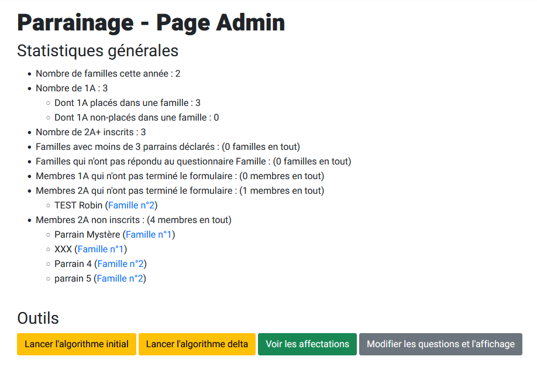

import './styles.scss';

# Parrainage

Cette page se destine à fournir des explications sur l'algorithme de parrainage pour Centrale Nantes, utilisé et mis en place par le BDE. Elle pourra notamment servir au pôle inté ou aux futurs DSI de l'association.

## 1. Contexte

### 1.1 Lexique

Chaque année, le BDE organise "le parrainage", c'est-à-dire que des nouveaux étudiants sont parrainés par les plus anciens afin de s'intégrer plus facilement dans l'école.
On distingue deux types de personnes :

- **les 1A :** ce terme regroupe les étudiants effectuant leur première année à Centrale Nantes, plus souvent dénommés les fillots. Le terme regroupe donc les EI1, mais aussi les ITII de 1ère année, ainsi que les étudiants étrangers en Double Diplôme en EI1 (DD) et les étudiants en mobilité intercentrale (qui sont donc en EI3).
- **les 2A+ :** ce terme regroupe les étudiants ayant déjà effectué une année à Centrale Nantes. Ceux-ci se réunissent en groupes de 2A+, appelés "familles".

:::info
Actuellement (en 2021), seules les filières ingénieurs généraliste et de spécialité sont concernées par le parrainage. Les masters, bachelors et doctorants sont considérés "à part" et ne sont pas parrainés.
:::

### 1.2 Déroulement

Le parrainage s'effctue généralement en plusieurs phases :

- **Phase 1 : Questionnaires 2A+ (mi-août à fin août)** - Les 2A+ remplissent les questionnaires familles et questionnaires individuels pour déclarer leur souhait de parrainer des 1A
- **Phase 2 : Questionnaires 1A (fin août à début septembre)** - Les 1A remplissent à leur tour le questionnaire
- **Phase 3 : La soirée de parrainage** - On lance l'algorithme qui permet de répartir les 1A dans les différentes familles de 2A+, puis les 1A doivent se réunir avec les autres 1A de la même famille et partir à la recherche de leurs parrains (les 2A+)
- **Phase 4 : Première fin du parrainage** - Le parrainage est terminé et tous les 1A connaissent leurs parrains 2A+
- **Phase 5 : Questionnaires ITII (début octobre)** - Les ITII faisant leur rentrée début octobre, une nouvelle phase de parrainage est mise en place. Il s'agit ici de seulement récolter leurs questionnaires pour ensuite les placer dans les familles déjà existantes
- **Phase 6 : Attibution des ITII aux familles (mi-octobre)** - On place les ITII dans des familles. Fin du processus de parrainage.

## 2. Utilisation de Nantral Platform pour le parrainage

### 2.1 Pourquoi utiliser Nantral Platform ?

Avant d'utiliser Nantral Platform, les questionnaires étaient conçus sous Google Form, et les réponses étaient ensuite récupérées puis entrées dans un script Python pour faire les attributions. Ce mode de fonctionnement, simple à mettre en place, présentait néanmoins quelques inconvénients :

- **une inconsistence des données :** pour les 2A+, deux formulaires étaient distribués, un pour déclarer les familles et le second pour chaque 2A+. Le problème était que tout le monde ne mettait pas forcément le même nom pour la famille ou pour l'étudiant 2A+ (différences d'accents et d'espaces, d'ordre nom/prénom, etc...), ce qui rendait très compliqué le traitement ensuite (il fallait juste tout reprendre à la main, ce qui était à la fois long et fastidieux). Nantral Platform permet de résoudre ce problème en utilisant le compte personnel de chaque utilisateur pour lier ces deux questionnaires.
- **un risque élevé de leak des familles :** avec l'ancienne méthode, la liste des attributions 1A/2A+ étaient publiées en public sur un site, dont le lien était seulement partagé aux parrains pendant la phase 3. Néanmoins certains 1A pouvaient aussi accéder à ce lien et ainsi découvrir leur famille. Avec Nantral Platform les accès aux données restent privées, ce qui limite les possibilités de leak.

D'autre part, le fait de basculer cette procédure sur Nantral Platform permet d'autres avantages :

- **un contrôle total des données et du processus :** on ne vend plus nos données à Google !
- **une motivation pour les 1A pour s'inscrire sur Nantral Platform :** cela permet d'être sûr qu'ils recevront bien ensuite toutes les infos sur les clubs et assos de l'école et facilitera la suite de leur scolarité !

### 2.2 Interface Admin

Si vous devez participer à l'organisation du parrainage, vous pouvez faire une demande auprès des administrateurs de Nantral Platform (en cas de doutes, adressez-vous au DSI du BDE) pour avoir accès à l'interface admin du parrainage.

:::caution Note aux admins de Nantral Platform
Les droits d'accès sont accordés en ajoutant l'utilisateur dans le groupe `admin-family` et en lui accordant le **statut équipe** dans l'interface administrateur de Django.
:::

L'interface admin se présente ainsi :

Cette page est accessible via le lien suivant : [nantral-platform.fr/parrainage/admin](https://nantral-platform.fr/parrainage/admin/). Vous avez accès à :

- des **statistiques** détaillées sur le remplissage des questionnaires : pour donner un ordre d'idée, on avait eu en 2021 65 familles de créées avec `341` 1A et `319` 2A+.
- des **outils** pour opérer des changements :
   - **Lancer l'algorithme initial :** Permet de lancer l'algorithme principal de mariage stable, pour attribuer des 1A dans des familles de 2A+ (cf. partie 3). Cet algo est lancé juste avant la phase 3, mais il peut aussi être lancé avant pour tester.
   - **Lancer l'algorithme delta :** au cas où des 1A n'ont pas rempli leur questionnaire avant que vous ayez lancé l'algorithme initial, vous pouvez quand même leur dire de remplir le questionnaire sur place pendant la phase 3, puis lancer l'algorithme delta pour les attribuer à une famille adaptée.
   - **Voir les affectations** : permet de voir les attributions 1A-2A+ enregistrées dans la base de données.
   - **Modifier les questions et l'affichage** : permet d'accéder à l'interface de gestion de la base de données pour modifier la **phase** en cours d'exécution et les différentes questions des questionnaires.

### 2.3 Changer la phase

Pour changer la phase, connectez-vous à l'interface admin du site en ligne.
Puis, dans la section **EXTRA SETTINGS**, sélectionnez **Paramètres**. Vous
pouvez alors changez la valeur du paramètre `PHASE_PARRAINAGE` d'après le
code suivant (cf la section 1.2) :

- `0`: Tout masquer
- `1`: Questionnaires 2A+
- `2`: Questionnaires 1A et 2A+
- `3`: Soirée de parrainage
- `4`: Résultats du parrainage
- `5`: Questionnaires ITII
- `6`: Résultats ITII

### 2.4 Ajouter ou modifier des questions

Il existe deux types de questions :

- Les questions membres
- Les questions familles

Comme leurs noms l'indiquent, les questions membres doivent être répondues par toutes les personnes participant au parrainage (1A et 2A+), alors que les questions familles ne doivent être répondues que par les parrains.

Pour ajouter une question membre (resp. famille), il suffit, depuis l'interface administrateur, de créer un objet dans la table Questions Membres (resp. Questions Familles) présente dans la catégorie FAMILY.

Il est possible de regrouper les questions dans des Groupes de Questions pour les afficher sous forme de matrice, mais aussi par Pages de Questions.

## 3. Fonctionnement des algorithmes et choix de conceptions

### Algorithme initial

L'algorithme initial est basé sur l'algorithme de Gale-Shapley, également connu sous le nom d'algorithme de mariage stable. Il permet de trouver une correspondance stable entre deux ensembles, en l'occurrence les 1A et les familles de 2A+.

### Algorithme delta

L'algorithme delta est une extension de l'algorithme initial, utilisé pour attribuer les 1A qui remplissent leur questionnaire après l'exécution de l'algorithme initial.

### Algorithme ITII

L'algorithme ITII est utilisé pour intégrer les étudiants ITII dans les familles existantes après leur rentrée en octobre.
