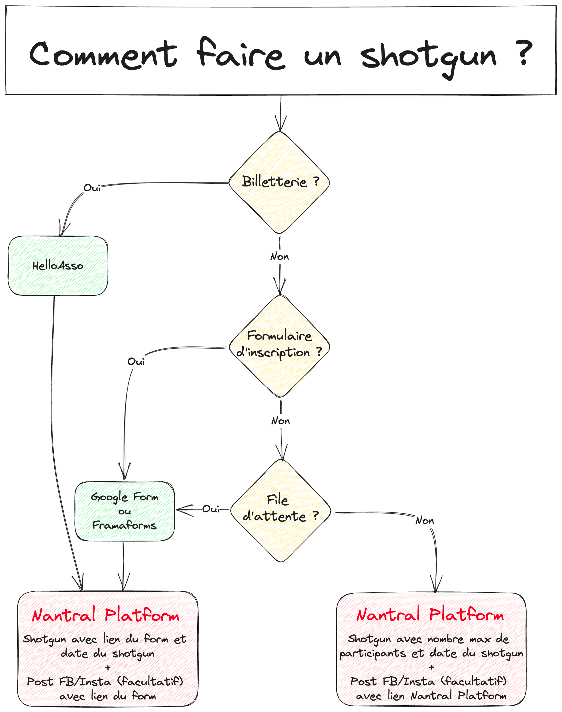
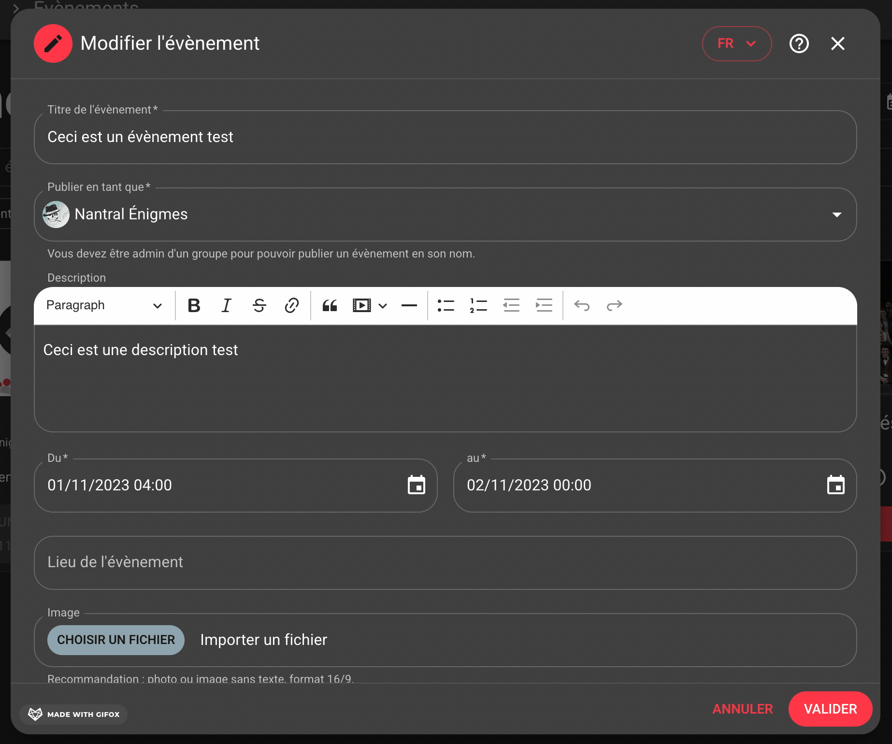
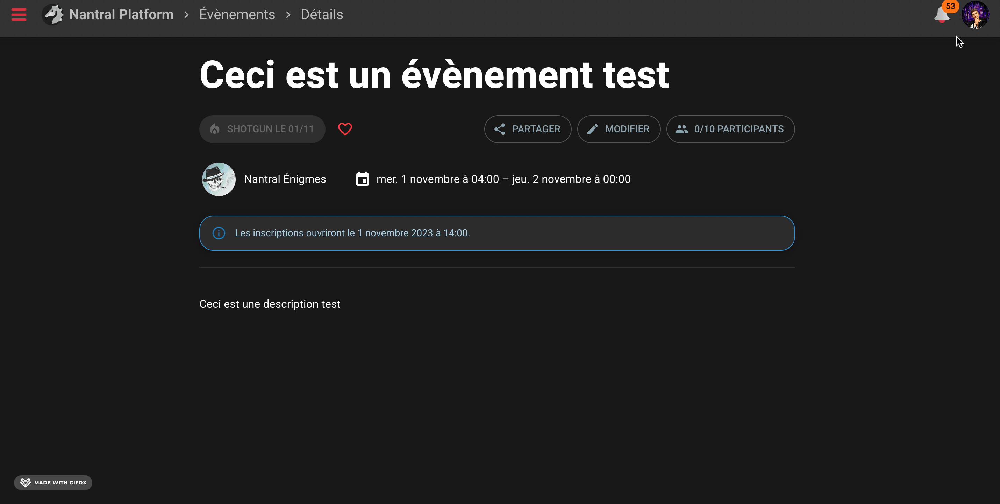

# Créer un évènement

Cette page explique comment ajouter un évènement sur Nantral Platform.

## 📝 Procédure

La procédure pour créer un évènement est la suivante :

1. Aller sur la page _Évènements_ du site : https://nantral-platform.fr/event
2. Cliquez sur le bouton (+) en bas à droite de l'écran
3. Remplissez le formulaire
4. Cliquez sur le bouton _Valider_

Et voilà, votre évènement est créé !

## 🔥 Les shotguns

Nantral Platform considère un évènement comme un shotgun dès que l'une des 3
limites suivantes pour les inscriptions est définie :

- la date de début des inscriptions
- la date de fin des inscriptions
- le nombre maximum de participants

Vous avez aussi la possibilité d'ajouter un lien vers un formulaire externe
(HelloAsso, Google Forms, FramaForms, etc.) si besoin.

Diagramme de décisions pour faire un shotgun sur Nantral Platform

:::caution Attention
Si vous ajoutez un lien, Nantral Platform ne peut plus compter le
nombre d'inscriptions : le critère du nombre max de participants est alors
désactivé et la liste des participants est masquée.
:::

Nantral Platform n'est pas prévu pour supporter trop de connexions en même
temps : si vous prévoyez que plus de 100 personnes se connecterons en même
temps pour votre shotgun, il est préférable d'utiliser une inscription via
un lien/formulaire par sécurité.

## 🇬🇧 Traductions

Vous pouvez traduire vos évènements dans toutes les langues disponibles sur le
site (actuellement Anglais et Français seulement). Pour ce faire :

- sélectionnez la langue avec le bouton en haut à droite de l'interface ;
- traduisez le titre et la description de l'évènement dans la langue choisie.

Une fois l'évènement publié, le site affiche automatiquement la bonne traduction
en fonction des préférences de l'utilisateur.

:::tip Bon à savoir
Si une traduction est manquante, le site affichera automatiquement le texte
dans l'autre langue pour que l'utilisateur n'ait pas un texte vide.
:::

## 🔔 Les notifications

Dès que vous cliquez sur le bouton _Valider_, une notification est aussitôt
créée et visible par tout le monde dans le menu de _Notifications_.

La notification sera aussi envoyée immédiatement sur les appareils
des utilisateurs qui **_suivent_** le groupe (i.e. qui ont cliqué
sur le bouton _Suivre_ sur la page du groupe).

Si vous modifiez l'évènement, la mise à jour sera appliquée à la notification
visible dans le menu _Notifications_, mais pas à la notification système envoyée
sur les appareils des utilisateurs. Les notifications ne seront pas non plus
supprimées si vous changez la visibilité de l'évènement.

## 🛟 FAQ

Je n'arrive pas à créer d'évènement

Vérifiez les points suivants pour pouvoir créer un évènement :

- vous devez être admin du groupe organisateur (pour devenir admin, allez sur
  la page du groupe puis cliquez sur le bouton _"Devenir admin"_ en bas de la
  page)
- l'évènement doit avoir une date de début et une date de fin

Je veux supprimer un évènement

Malheureusement, l'interface pour supprimer un évènement n'est pas encore
disponible. Il vous reste deux solutions :

- Contactez un admin : il pourra le faire pour vous.
- Connectez-vous à l'API, en remplaçant `/event/<id>` dans l'url de la
  page de votre event par `/api/event/event/<id>`. Vous pourrez alors
  supprimer l'event avec le bouton _DELETE_.

Je veux créer un shotgun mais je n'ai pas toutes les options dont j'ai besoin

Si vous avez besoin d'options supplémentaires pour votre shotgun, vous pouvez
utiliser un formulaire externe (HelloAsso, Google Forms, FramaForms, etc.) et
ajouter le lien dans la description de l'évènement.

Si vous pensez que cette option pourrait être ajoutée au site et serait utile à
d'autres events, n'hésitez pas à
[ouvrir un ticket](https://nantral-platform.fr/suggestions/) pour suggérer
l'idée !

